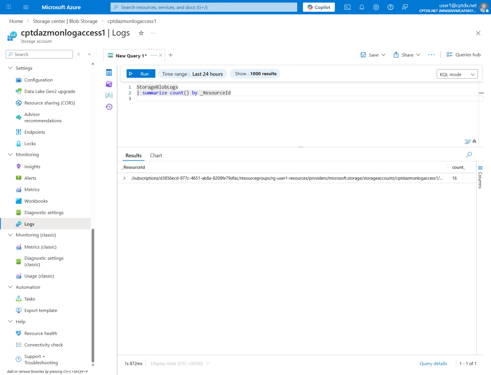
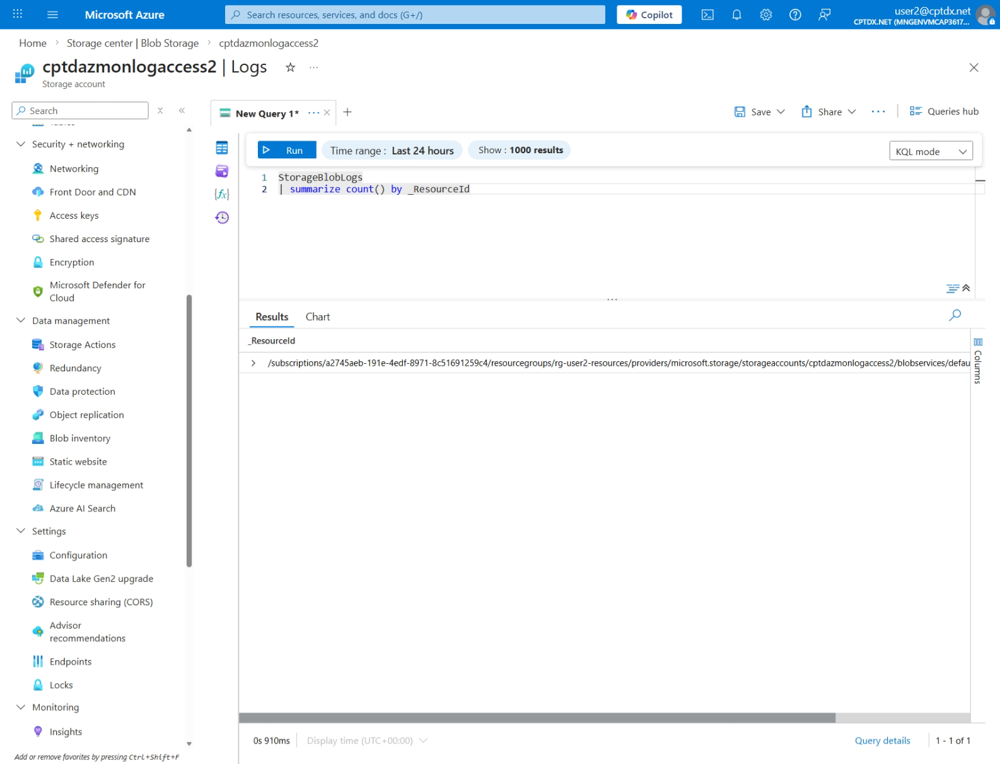
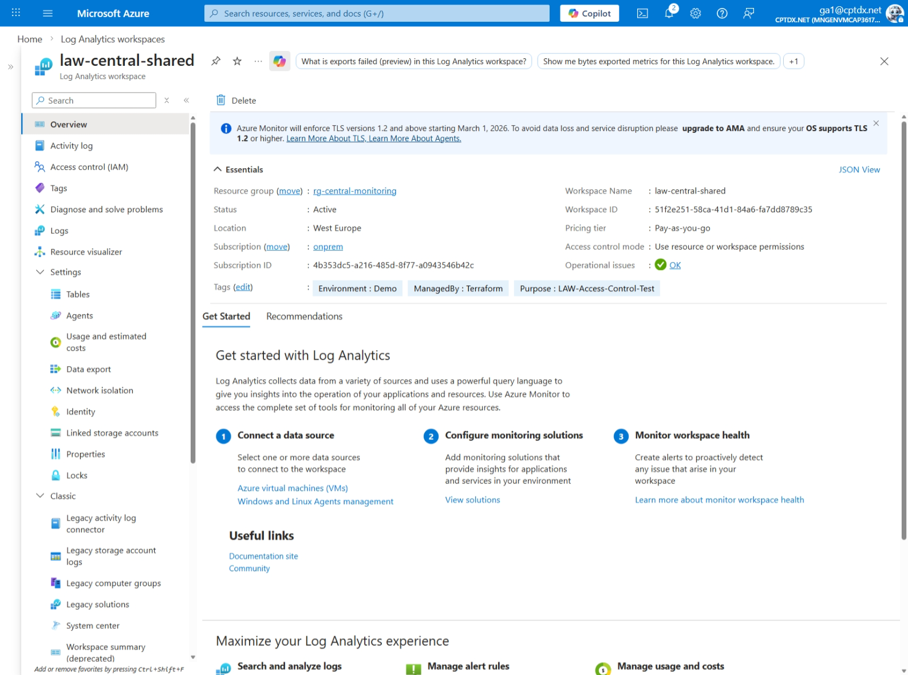
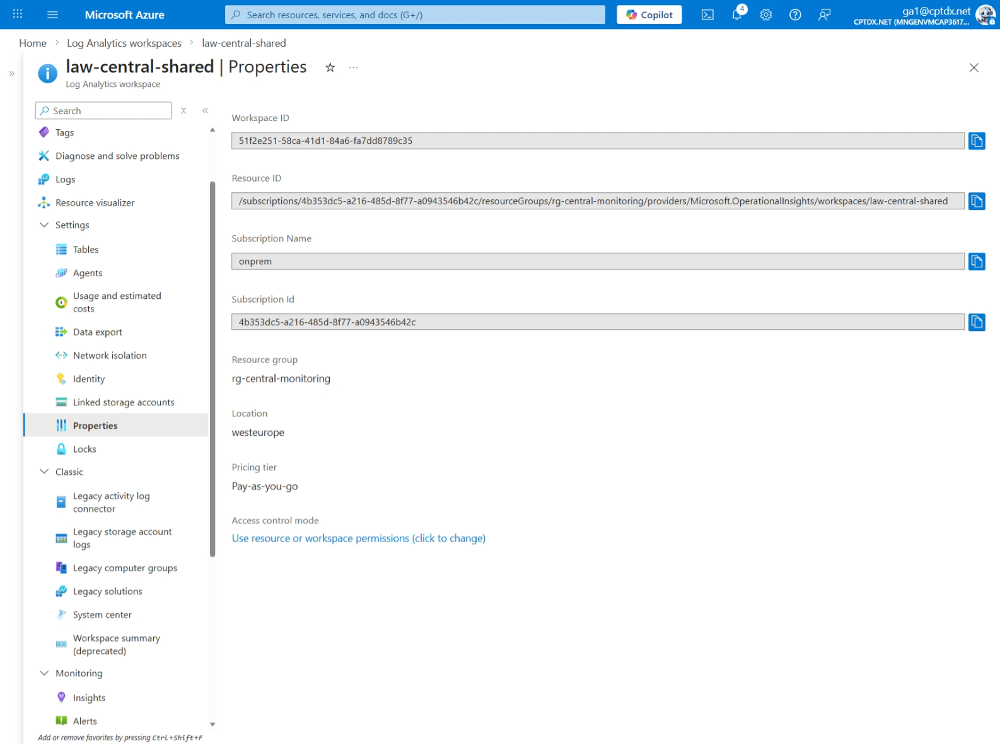
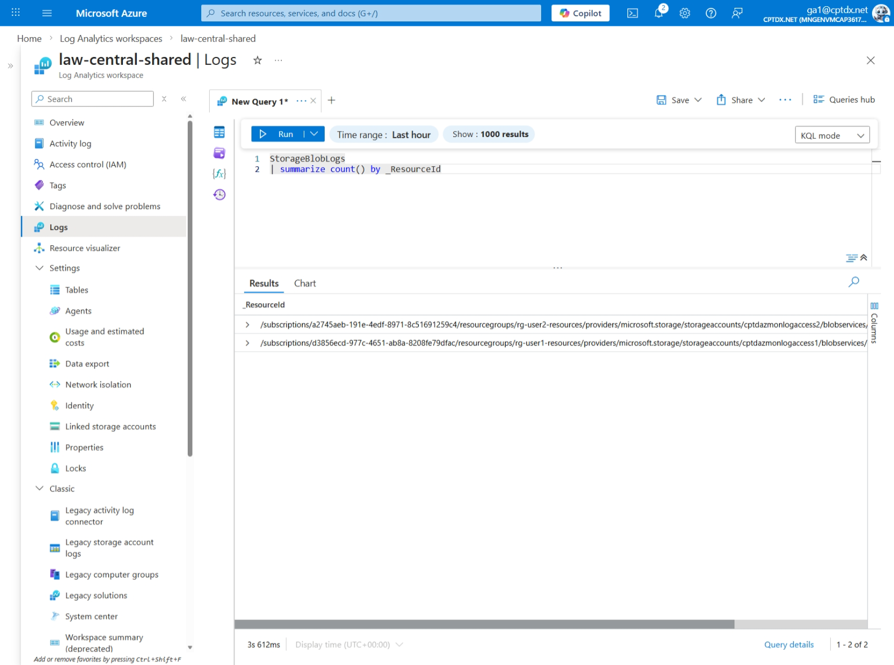

# Log Analytics Workspace - Resource-Context Access Control Demo

This project demonstrates how multiple users can share a central Log Analytics Workspace where each user can **only see logs from their own resources**.

## 🎯 Scenario

```
┌─────────────────────────────────────────────────────────────────────────┐
│                    Central Subscription                                 │
│                    (4b353dc5-a216-...)                                  │
│  ┌─────────────────────────────────────────────────────────────────┐    │
│  │              Log Analytics Workspace                            │    │
│  │         (Resource-Context Access Control)                       │    │
│  │                                                                 │    │
│  │   ┌──────────────────┐        ┌──────────────────┐              │    │
│  │   │ User1's Logs     │        │ User2's Logs     │              │    │
│  │   │ (visible only    │        │ (visible only    │              │    │
│  │   │  to User1)       │        │  to User2)       │              │    │
│  │   └────────▲─────────┘        └────────▲─────────┘              │    │
│  └────────────┼───────────────────────────┼────────────────────────┘    │
└───────────────┼───────────────────────────┼─────────────────────────────┘
                │                           │
    ┌───────────┴───────────┐   ┌───────────┴───────────┐
    │  User1 Subscription   │   │  User2 Subscription   │
    │  (d3856ecd-...)       │   │  (a2745aeb-...)       │
    │  ┌─────────────────┐  │   │  ┌─────────────────┐  │
    │  │ Storage Account │──┼───┼──│ Storage Account │  │
    │  │ + Diag Settings │  │   │  │ + Diag Settings │  │
    │  └─────────────────┘  │   │  └─────────────────┘  │
    │                       │   │                       │
    │  SP: Reader only      │   │  SP: Reader only      │
    │  User1: Reader only   │   │  User2: Reader only   │
    └───────────────────────┘   └───────────────────────┘
```

## 🔑 How Does It Work?

### 1. Resource-Context Access Control

The Log Analytics Workspace is configured in terraform with **`enableLogAccessUsingOnlyResourcePermissions = true`**. 

This means:
- Users can only see logs from resources they have Azure RBAC read permissions on
- The `_ResourceId` column in the logs is used to filter access
- No workspace-level permissions required!

> NOTE: have a look at the official documention to learn more about it: https://learn.microsoft.com/en-us/azure/azure-monitor/logs/manage-access?tabs=portal#access-mode

### 2. RBAC Setup

All our user are protected via MFA, therefore we introduce Service Principal (SP) to allow us to test via the Azure Portal with Users and test via the Jupyter Notebook with Service Principals.

> NOTE: Usage of SP does allow us to switch easily between SP inside the Jupyter Notebook as we will see later on.

| User | Permission | Scope |
|------|-----------|-------|
| SP1 | Reader | User1's Storage Account |
| SP2 | Reader | User2's Storage Account |
| SP1 | Contributor | User1's Subscription |
| SP2 | Contributor | User2's Subscription |
| User1 | Reader | User1's Storage Account |
| User2 | Reader | User2's Storage Account |
| User1 | Reader | User1's Resource Group |
| User2 | Reader | User2's Resource Group |

> NOTE: Users do not really need Reader Role on Resource Group but for better portal experience we assign it.


## 🚀 Deployment

### Prerequisites

1. Azure CLI installed and logged in
2. Terraform >= 1.5.0
3. Permissions on all three subscriptions
4. Service Principal Object IDs for User1 and User2

### Steps

```powershell
# 1. Navigate to the Terraform directory
cd terraform

# 2. Create terraform.tfvars
cp terraform.tfvars.example terraform.tfvars

# 3. Get Service Principal Object IDs
az ad sp show --id <User1-App-Id> --query id -o tsv
az ad sp show --id <User2-App-Id> --query id -o tsv

# 4. Update terraform.tfvars with the Object IDs

# 5. Initialize Terraform
terraform init

# 6. Create plan
terraform plan

# 7. Apply
terraform apply
```

## 🧪 Testing

### Manual Test in Azure Portal

1. **Log in as User1**
2. Navigate to Storage Account → Monitoring → Logs
3. Run query: `StorageBlobLogs| summarize count() by _ResourceId`
4. ✅ Only one -resourceId (User1's) logs should be visible


1. **Log in as User1**
2. Navigate to Storage Account → Monitoring → Logs
3. Run query: `StorageBlobLogs| summarize count() by _ResourceId`
4. ✅ Only one -resourceId (User1's) logs should be visible


1. **Log in as User which has access to LAW**
2. Navigate to LAW → Overview
On the screenshot you will see the current "Access control mode" set to "Use resource or workspace permissions".

3. Navigate to LAW → Settings → Properties
Here you can change the "Access control mode" if you like, but this is not needed for this demo.

4. Navigate to LAW → Logs
1. Run query: `StorageBlobLogs| summarize count() by _ResourceId`
1. ✅ Two -resourceId (User1 and User2) logs should be visible


### Manual Test via Jupyter Notebook

In addtion to the manuel test done via the portal, we also tested via the Service Principal by using a Jupyther Notebook.

## ⚠️ Important Notes

1. **Log Latency**: Logs appear 5-10 minutes after the action
2. **_ResourceId**: Every log entry must have a `_ResourceId` column
3. **Access Mode**: The LAW must be in "Use resource or workspace permissions" mode
4. **No Workspace Permissions**: Users must NOT have query permissions on the LAW


## 📚 References

- [Manage access to Log Analytics workspaces](https://learn.microsoft.com/en-us/azure/azure-monitor/logs/manage-access)
- [Granular RBAC in Azure Monitor](https://learn.microsoft.com/en-us/azure/azure-monitor/logs/granular-rbac-log-analytics)
- [Resource-context access](https://learn.microsoft.com/en-us/azure/azure-monitor/logs/manage-access#access-mode)

## 🧹 Cleanup

```powershell
terraform destroy
```
